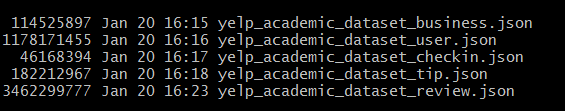

## Objective

This project is driven by Yelp Academic Data Set, which is offered via Yelp Data Challenge. Yelp is one of the leading online recommendation sites for Restaurants and other local businesses, and it is very popular in North America and Europe. 

Our objective with the project is two-fold-
1. Sentiment Analysis: Analysing if Yelp Reviews for a Restaurants correlate with Health Inspection Grades issued by the city.
2. Exploratory analysis: Explore the Yelp Dataset to spot 
   a) Locational concentrations of high quality restaurants
   b) Variation in Cultural Trends and Preferences across Major Cities

## Approach  
The method used in this project in order to answer the primary questions was an OSEMN workflow approach. In this approach, there are five distinct stages: Obtain Data, Scrub Data, Explore, Model and iNterpret.


  
## Introduction to the Data
The data set comprises of following files -


It is a large dataset with details of about 4 million reviews, 1 million users and 144 thousand businesses.


The schema of the json files is as follows -


More details about the challenge, dataset an its schema can be seen at the Yelp Data Challenge website.


## Maintaining the Data on Remote Server

The data was maintained on SQL Server in Microsoft Azure Cloud. The data upload was an extensive exercise which took multiple days due to sheer volume of records. The R packages used to help in this were RODBC and jsonlite. RODBC was chosen because RSQLServer has been deprecated by CRAN-R and is no longer actively supported.

Example of how connection was established - 
```{r}
library(RODBC)
connectionString <- "Driver=ODBC Driver 13 for SQL Server;Server=tcp:data607yelp1.database.windows.net,1433;Database=DATA607_FinalProject_Yelp1;Uid=data607@data607yelp1;Pwd=XXXXX;Encrypt=yes;TrustServerCertificate=no;Connection Timeout=30;"
#conn <- odbcDriverConnect(connectionString)
```

The tables uploaded were, which correspnd to yelp files mentioned above -
YelpBusiness
YelpUser
YelpReview


Once the data was uploaded multiple tables were created on server side as well to help the analysis -
YelpLVBusiness - Restaurants in Las Vegas
YelpLVReview - Reviews for Restaurants in Las Vegas
YelpLVReviewTokens - Tokens from Sample Las Vegas Reviews to be used in Sentiment Analysis  
YelpRestaurants - All Yelp Restaurants
YelpRestaurantCategory - Restaurants and their Category (~Cuisine) table


```{r}
library(dplyr)
library(tidytext)
library(stringr)
library(ggplot2)
library(RODBC)
library(ggrepel)
library(knitr)
library(tidyr)
library(jsonlite)
library(leaflet)
library(dplyr)
```


## Analysing the Health Inspection

*Obtain Data*
The first step was to retrieve data regarding health inspection grades, restaurant/food/drink businesses and reviews/ratings of said businesses. The two sources were the Yelp Dataset Challenge data (can be found here: https://www.yelp.com/dataset_challenge) and, under the US City Open Data Census website, the Las Vegas Health Inspection Data, whose location was chosen for its larger data pool in Yelp reviews, (can be found here: http://us-city.census.okfn.org/entry/vegas/food-safety). The Health Inspection data was in a csv format, while the Yelp Dataset came in the form of json files (User, Business and Reviews), all of which were entered into an SQL database.

*Scrub Data*
The primary goal when scrubbing was to first combine multiple datasets while retaining as much information as possible, to ensure that there were no duplicate entries, that entries were formatted correctly, that missing data was removed (to the capacity that it was allowed without making the data pool too small) and that headings and data entries were consistant for future analysis.

*Explore*
Even though there were questions created before combining the datasets, many of our approaches and goals had to be readjusted when finally working with the combined data. After getting a sense of what kind of information we would be working with and the value of each variable in regard to our overall project, we were allowed to shift and narrow down our focus to determining the relationship between Yelp Reviews/Ratings (with an importance on hygiene) and Health Inspection Grades, in addition to analyzing what cuisines were more prominent across major cities within the U.S. and outside it.

*Model*
In order to analyse the Yelp Reviews, a sentiment analysis was run, using a Health Lexicon to determine if the users' opinion regarding the health status of the establishment matched that of the Health Inspectors. In addition, a regression model was used to determine the importance of the variables against the establishments' overall rating in order to determine if any factors contributed more to a higher rating. Visual correlations were also made to enhance the conclusion formed by the regression.

*Interpret*
The conclusions made were based on the models and visual analyses created during the "Model" portion of the data science workflow.

It should be noted that, due to the nature of the project, in addition to a vast number of unforseen occurences when handling the data, this workflow structure was not followed as rigidly as stated above. In times when a portion of a dataset that was deemed unecessary (and thus discarded earlier in the project) proved to be important, this workflow was used (within already another step of the primary analysis method timeline) until all necessary data was available for handling.

###Yelp Data
```{r}
###############  YELP   
connectionString = "driver=ODBC Driver 13 for SQL Server;Server=tcp:data607yelp1.database.windows.net,1433;Database=DATA607_FinalProject_Yelp1;Uid=data607@data607yelp1;Pwd=Ozymandias123;Encrypt=yes;TrustServerCertificate=no;Connection Timeout=30;"
conn = odbcDriverConnect(connectionString)

# YelpUser
User = sqlQuery(conn, "SELECT * FROM YelpUser;")
# YelpReview
Review = sqlQuery(conn, "SELECT * FROM YelpLVReview;")
# YelpBusiness
LasVBus = sqlQuery(conn, "SELECT * FROM YelpLVBusiness;")

User = User[ c(1,3)]
Review = Review[ c(1:6)]
LasVBus = LasVBus[ c(1:11)]

kable(head(LasVBus))
```


###Health Inspection Data
```{r}
###############  INSPECTIONS   ###############  
LVInspection = read.csv("https://raw.githubusercontent.com/Galanopoulog/Final-Project/master/LVInspections.csv", header = T, stringsAsFactors = T)

levels(LVInspection$Inspection.Grade)[2] = "A"
levels(LVInspection$Inspection.Grade)[3] = "B"
levels(LVInspection$Current.Grade)[2] = "A"

kable(head(LVInspection))
```


###Combining Health Inspection data with LasVegas Business data
```{r}
names(LasVBus)[2]= "Restaurant.Name"
names(LasVBus)[4]= "Address"

nondupl = LVInspection[!duplicated(LVInspection[,c('Restaurant.Name','Address')]),]
nondupl= nondupl[ c(3,6,10,11:13,17:22)]

Combined = merge(LasVBus, nondupl, by = c('Restaurant.Name','Address'))
Combined = Combined[,c(3,1,2,4,5,6,7,8,9,10,11,13,17,12,16,14,15,21,18:20)]
kable(head(Combined))
```

###Combining User data with Review data based on the Business data
```{r}
UserReview = merge(User, Review, by = c('user_id'))
UserbyBusiness = semi_join(UserReview, Combined, by = "business_id")
```


###Analyzing the Health Inspection data
```{r}
# looking at grades and their demerit points
# Histograms
par(mfrow = c(1,2))
ggplot(LVInspection, aes(x=Inspection.Grade, y=Inspection.Demerits)) + geom_bar(stat="identity") + 
  labs(x="Inspection.Grade", y="Inspection.Demerits")

ggplot(LVInspection, aes(x=Current.Grade, y=Current.Demerits)) + geom_bar(stat="identity") + 
  labs(x="Current.Grade", y="Current.Demerits")

# Boxplots
par(mfrow = c(1,2))
boxplot(Inspection.Demerits ~ Inspection.Grade,data=LVInspection, main="Inspection Demerit Points by Grade",
        xlab="Inspection Grade", ylab="Inspection Demerits", ylim = c(0,120))

boxplot(Current.Demerits ~ Current.Grade,data=LVInspection, main="Demerit Points by Grade",
        xlab="Current Grade", ylab="Current Demerits",ylim = c(0,120))

```

We notice that during the Inspection, the majority of the business were classified as "A" grade, though it might have been expected to see a normal distribution in which, perhaps a "B" grade was more common. However, after the inspection, there was a dramatic shift in the grades in that the majority of businesses were upgraded to "A" grade, which may imply that after their grading, the businesses focused to reslove the issues that caused them demerit points. This seems more evident with the boxplots, where the upper outliers for demerits in each grades have radically decreased.


### Adressing Questions


### 1. Relationship exists between Yelp ratings and Inspection Ratings

```{r}
pairs(Combined[,c("stars","review_count","Current.Grade","Current.Demerits","Inspection.Grade","Inspection.Demerits")])

```

We see here that there doesn't visually appear to exist a correlation between these variables. Nonetheless, we run a multiple regression.
```{r}
# Regression
regstar = lm(stars ~ review_count + Current.Grade + Current.Demerits + Inspection.Grade + Inspection.Demerits, data = Combined)

summary(regstar)


hist(regstar$residuals, main = "Regression Residuals")

# normal probability plot
qqnorm(regstar$residuals)
qqline(regstar$residuals)

# constant variability
plot(regstar$residuals ~ Combined$review_count, main = "Variability")
abline(h = 0, lty = 3)
```

This multiple regression is not fit to be run. The residuals histogram is somewhat left skewed, the data along the qq plot is off the line and there exists a pattern when testing the residuals for constand variability. The regression itself only primarily the "reviews_count" variable to have any significant effect on the "stars" variable. So, we can run another regression with only that variable to take into account.


```{r}
regstarrev = lm(stars ~ review_count, data = Combined)

summary(regstarrev)


hist(regstarrev$residuals, main = "Regression Residuals")

# normal probability plot
qqnorm(regstarrev$residuals)
qqline(regstarrev$residuals)

# constant variability
plot(regstarrev$residuals ~ Combined$review_count, main = "Variability")
abline(h = 0, lty = 3)
```

This, too, was a failed attempt at explaining the star ratings. The R-squared of this regression showed that very little variability was explained this and the previous model.


## Sentiment analysis
```{r}
UserbyBusiness = UserbyBusiness[!duplicated(UserbyBusiness), ]
ReviewsGrades = merge(UserbyBusiness, Combined, by = "business_id")

groupings <- ReviewsGrades %>% select(business_id, Inspection.Grade) %>% filter(Inspection.Grade=='C') %>% group_by(business_id, Inspection.Grade) %>% summarise()
groupings$business_id
#%>% rapply(function(x)length(unique(x))) 

# Sentiment analysis
reviews = as.list(as.character(ReviewsGrades$text))


analysis <- sqlQuery(conn, "Select * from YelpLVReviewTokens")


```

```{r}


# using lexicon to score words
#lexicon = data.frame(get_sentiments("afinn"))
lexicon = read.csv("https://raw.githubusercontent.com/jmehta753/MSDA_JM/master/DATA607/Final%20Project/HygieneLexicon.csv")
af.sent = data.frame(merge(analysis, lexicon, by.x="word", by.y="word") %>% 
                      group_by(review)%>% 
                       mutate(mean.af.sent = mean(score)))

names(af.sent)[2] = "review_id"


# combining scores to business data
review.analysis = merge(af.sent, ReviewsGrades, by = "review_id")
```


### Plots

MEAN SCORE BY STARS

These plots are separated into two sections: Star scores each user alloted to the restaurant and the overall score Yelp gave the restaurant based on the users' reviews. It will be interesting to see what the connection is between these two variables and the mean sentiment score, in order to determine if, firstly, the sentiment analysis was somewhat accurate, and, second, to see if the overall rating of the business matches the sentiment scores.
```{r}
# Users' stars for the restaurant
par(mfrow = c(1,2))
boxplot(mean.af.sent~ stars.x, data=review.analysis[!duplicated(review.analysis), ], 
        main="Mean Sentiment Score by Users' Star Scores",xlab="Users' Stars", ylab="Mean Sentiment Score")
abline(h = 0, lty = 3)
# Overall star rating for the restaurant
boxplot(mean.af.sent~ stars.y, data=review.analysis[!duplicated(review.analysis), ], 
        main="Mean Sentiment Score by Restaurants' Star Scores",xlab="Restaurant Stars", ylab="Mean Sentiment Score")
abline(h = 0, lty = 3)
```


MEAN SCORE BY GRADE

The boxplot is based on Current Inspection Grade. What would be interesting to note here is if there is a relationship between the inspection grades and the review sentiments (meaning, if the users' opinion match or are related in some way to the inspection grades).
```{r}

# Current Grade
boxplot(mean.af.sent~ Current.Grade, data=review.analysis[!duplicated(review.analysis), ], 
        main="Mean Sentiment Score by Current Grade",xlab="Current Grade", ylab="Mean Sentiment Score")
# Inspection Grade
boxplot(mean.af.sent~ Inspection.Grade, data=review.analysis[!duplicated(review.analysis), ], 
        main="Mean Sentiment Score by Inspection Grade",xlab="Current Grade", ylab="Mean Sentiment Score")

abline(h = 0, lty = 3)
```

STARS BY GRADE

The boxplot is based on Current Inspection Grade. What would be interesting to note here is if there is a relationship between the inspection grades and the review sentiments (meaning, if the users' opinion match or are related in some way to the inspection grades).
```{r}
boxplot(stars.x ~ Current.Grade, ReviewsGrades, 
        main="Users' Star Scores by Current Inspection Grades",xlab="Current Grade", ylab="Stars")
abline(h = 0, lty = 3)
```

WORDS BY USERS' STAR SCORE

Plotting the words that the afinn lexicon determined as positive/negative

The detail to pay attention to here is not only the words that 5-star reviews earned, but whether the words for higher star scores are related to health/cleanliness. At first glance, the majority of the words have more to do with taste than hygiene. 

```{r}
# Plots of the words scores vs the users' star score for each restaurant.
ggplot(review.analysis, aes(score, stars.x, group = score)) + 
  geom_point(aes(colour = factor(score))) +
  geom_label_repel(aes(label=word)) +
  xlab("Word Score") +
  ylab("Users' Stars Scores")
```


## Location Analysis through Visualization
We are interested in knowing how the restaurants are concentrated in Las Vegas and if we can spot where some of its great restaurants are located through visual analysis. It is well known that Las Vegas strip is home to multiple high quality restaurants but are there any other surprises?

### Extract the Yelp Restaurants data from database
```{r}
vegasFrame <- sqlQuery(conn, "select * from YelpLVBusiness")
head(vegasFrame)
vegasFrame %>% select(stars) %>% group_by(stars)
content <- function(name, address, neighbourhood) {
    paste(sep = "<br/>",
    "<b>", name,"</b>",
    address, neighbourhood
  )
}
```

### Plot all the restaruants on the map to view the concentrations
```{r}
colorDomain <- c(0.0,0.5,1.0,1.5,2.0,2.5,3.0,3.5,4.0,4.5)
pal <- colorNumeric("YlGn", colorDomain, na.color = "transparent")
leaflet(vegasFrame) %>% addTiles() %>% setView(lng = -115.1398, 
    lat = 36.1699, zoom = 12) %>% addCircles(lng = ~longitude, lat = ~latitude, 
    weight = 0, radius = ~exp(stars*1.2) , fillOpacity = 0.5,  
    color = ~pal(stars),
    popup = ~content(name, address, neighborhood)) 
```

Expectedly there are multiple areas of concentrations within las vegas.

### Plot only the high ranked restaurants on the map
As our above map was bit crowded we use a different approach to plot the map by clustering the spots together.

```{r}
vegasTopFrame = vegasFrame %>% filter(stars>=4.0)
leaflet(vegasTopFrame) %>% addTiles() %>% setView(lng = -115.1398, 
    lat = 36.1699, zoom = 12) %>% addCircleMarkers(lng = ~longitude, lat = ~latitude, 
    popup = ~content(name, address, neighborhood), clusterOptions = markerClusterOptions()) 
```

### Conclusion : While the Strip expectedly has highest number of high quality restaurants (at 268), it came as a surprise that Chinatown (with 166) and Downtown (with 157) has very large number of such places too.


## Analysing the cultural trends and preferences across various cities
The approach taken here is to measure the popularity of various types of cuisines in major cities by counting the number of reviews for restaurants belonging to such category.


### First lets load the restaurant and category data from database 
```{r}
YelpRestaurants <- sqlQuery(conn, "Select * from YelpRestaurants")
YelpRestaurantsCategory <- sqlQuery(conn, "Select * from YelpRestaurantCategory")
names(YelpRestaurants)
names(YelpRestaurantsCategory)
```

### Classify Reviews by Year
```{r}
AllReviews = sqlQuery(conn, "Select business_id, stars, date from YelpReview")
ReviewsByYear <- AllReviews %>% select(business_id, stars, date) %>% mutate(year = substring(date, 1,4)) 
ReviewsByYear <- ReviewsByYear %>% group_by(business_id, year) %>% summarise(meanStar = mean(stars), count=n())
kable(ReviewsByYear)
```

### Combine Reviews with City (from Restaurants data) and Category data
We also compute the total number of reviews in each city-category combination

```{r}
BusinessByCity <- YelpRestaurants %>% select(business_id, city)
BusinessByCityAndCategory <- inner_join(BusinessByCity, YelpRestaurantsCategory, by.x="business_id", by.y="business_id")
BusinessYearOnYearGrid <- inner_join(BusinessByCityAndCategory, ReviewsByYear, by.x="business_id", by.y="business_id") %>% group_by(city, category, year) %>% summarise(count=n()) 
BusinessYearOnYearGrid1 <- BusinessYearOnYearGrid %>% spread(key=year, value=count)
BusinessYearOnYearGrid1[is.na(BusinessYearOnYearGrid1)] <- 0
BusinessYearOnYearGrid1 <- BusinessYearOnYearGrid1 %>% group_by(city, category) %>% mutate(total=`2004`+`2005` + `2006`+`2007` +`2008`+`2009` + `2010`+`2011` + `2012`+`2013` + `2014`+`2015` + `2016`+`2017`)
BusinessYearOnYearGrid1<- BusinessYearOnYearGrid1 %>% arrange(desc(total))
kable(BusinessYearOnYearGrid1)
```


### Spotting Cultural Trends 

#### Comparing American cities
We don't consider Las Vegas here as it is not a representative city due to its unusual concentration of restaurants and atypical culture.
```{r}
## Categories which we think are redundant
redundantCat <- c('Bars', 'Nightlife', 'Event Planning & Services', 'Delis', 'Caterers', 'Pubs')

## Plot American cities
AmerBusinessYearOnYearGrid <- BusinessYearOnYearGrid1 %>% filter(city %in% c('Charlotte','Pittsburgh', 'Phoenix')) %>% arrange(desc(total))

# Filter out redundant categories and keep only where number of reviews is atleast 300
AmerBusinessYearOnYearGrid <- AmerBusinessYearOnYearGrid %>% filter(!category %in%  redundantCat) %>% filter(total > 300) %>% select(total)

ggplot(AmerBusinessYearOnYearGrid, aes(x = city, y = category, label = `total`)) + 
    geom_point(aes(size = `total` * 2, colour = category, alpha = 0.05)) + 
    geom_text(hjust = 0.4, size = 3) + scale_size(range = c(1, 30), guide = "none") + labs(title = "American Cities Cuisine Preferneces", x = "City", y = "Category") + theme(plot.margin = unit(c(0.02,0.02,0.02,0.02),"cm"))


```

#### Conclusions: 
1. Phoenix appears to be more diverse than Pittsburgh and Charoltte. Unsurprisingly the Mexican count is much higher there due to its high Latino influence.
2. Charolette has a number of reviews for Southern cuisine, which is completely lacking in other two. Surprsingly its Cafe culture is yet to develop here.
3. Pittsburgh is least diverse of all, and surprisingly not enough liking for Steakhouses is seen.


#### 1. Comparing Canadian cities
```{r}

## Plot Canadian cities
CanadianBusinessYearOnYearGrid <- BusinessYearOnYearGrid1 %>% filter(city %in% c('Toronto', 'Montréal')) %>% arrange(desc(total))

# Filter out redundant categories and keep only where number of reviews is atleast 300 
CanadianBusinessYearOnYearGrid <- CanadianBusinessYearOnYearGrid %>% filter(!category %in%  redundantCat) %>% filter(total > 400) %>% select(total)
CanadianBusinessYearOnYearGrid

ggplot(CanadianBusinessYearOnYearGrid, aes(x = city, y = category, label = `total`)) + 
    geom_point(aes(size = `total` * 2, colour = category, alpha = 0.05)) + 
    geom_text(hjust = 0.4, size = 3) + scale_size(range = c(1, 30), guide = "none") + labs(title = "Canadian Cities Cuisine Preferneces", x = "City", y = "Category") + theme(plot.margin = unit(c(0.02,0.02,0.02,0.02),"cm"))

```

#### Conclusions: 
1. Toronto comes out to be a signifcantly more diverse city. So in this way its hold its reputation of being a world city, much like New york.
2. Montreal's absence of anything but french and traditional food is very stark. For examples, we don't see Middle Eastern, Mexican or Indian counts.
3. Only cuisine which stands out as non-traditional for Montreal is Sushi bars. Is it because it is trendy and healthy which appeals to Montreal's europe-like tastes?


```{r}

## Plot Euro cities
EuroBusinessYearOnYearGrid <- BusinessYearOnYearGrid1 %>% filter(city %in% c('Edinburgh', 'Stuttgart')) %>% arrange(desc(total))
EuroBusinessYearOnYearGrid <- EuroBusinessYearOnYearGrid %>% filter(!category %in%  redundantCat) %>% filter(total > 200) %>% select(total)

ggplot(EuroBusinessYearOnYearGrid, aes(x = city, y = category, label = `total`)) + 
    geom_point(aes(size = `total` * 2, colour = category, alpha = 0.05)) + 
    geom_text(hjust = 0.4, size = 3) + scale_size(range = c(1, 30), guide = "none") + labs(title = "European Cities Cuisine Preferneces", x = "City", y = "Category") + theme(plot.margin = unit(c(0.02,0.02,0.02,0.02),"cm"))

```

#### Conclusions: 
1. What stands out for Scotland is Gastropubs and for Stuttgart is Beer Gardens.
2. Edinburgh seems to have a large presence of Indian cuisine which is in line with Curry influence in UK.

### Comparing the continents through representative cities
```{r}
## Plot cities
AcrossBusinessYearOnYearGrid <- BusinessYearOnYearGrid1 %>% filter(city %in% c('Phoenix', 'Toronto', 'Stuttgart')) %>% arrange(desc(total))

AcrossBusinessYearOnYearGrid <- AcrossBusinessYearOnYearGrid %>% filter(!category %in%  redundantCat) %>% filter(total > 400) %>% select(total)

ggplot(AcrossBusinessYearOnYearGrid, aes(x = city, y = category, label = `total`)) + 
    geom_point(aes(size = `total` * 2, colour = category, alpha = 0.05)) + 
    geom_text(hjust = 0.4, size = 3) + scale_size(range = c(1, 30), guide = "none") + labs(title = "Comparative Analysis", x = "City", y = "Category") + theme(plot.margin = unit(c(0.02,0.02,0.02,0.02),"cm"))

```

#### Conclusions: 
What is most striking here is Toronto's amazing diversity of cuisines, as we noted above as well.

### New Age and Trends Food in various cities
We want to see how cities fare for various new trends.
```{r}

newAgeFood <- c('Asian Fusion', 'Gastropubs', 'Salad', 'Vegan', 'Vegetarian', 'Wine Bars', 'Cafes', 'Juice Bars & Smoothies', 'Tea Rooms', 'Sushi Bars')

AllBusinessYearOnYearGrid <- BusinessYearOnYearGrid1 %>% filter(city %in% c('Charoltte', 'Toronto', 'Edinburgh', 'Phoenix', 'Montréal', 'Pittsburgh', 'Stuttgart')) %>% arrange(desc(total))
AllBusinessYearOnYearGrid <- AllBusinessYearOnYearGrid %>% filter(category %in% newAgeFood)
AllBusinessYearOnYearGrid <- AllBusinessYearOnYearGrid %>% filter(!category %in%  redundantCat) %>% filter(total > 0) %>% select(total)

ggplot(AllBusinessYearOnYearGrid, aes(x = city, y = category, label = `total`)) + 
    geom_point(aes(size = `total` * 2, colour = category, alpha = 0.05)) + 
    geom_text(hjust = 0.4, size = 3) + scale_size(range = c(1, 30), guide = "none") + labs(title = "Trends and Latest", x = "City", y = "Category") + theme(plot.margin = unit(c(0.02,0.02,0.02,0.02),"cm"))
```

#### Conclusions: 
1. The Vegan and Vegetarian culture is already mature in Montreal, Toronto and Phoenix, but is yet to catch up in Edinburgh and Stuttgart. Same can be said for Salad too.
2. There seems no place for Juice bars in Stuttgart. Is it because of strong beer culture?

### Pubs and Bars Across the cities

```{r}
nightlife <- c('Bars', 'Gastropubs', 'Beer', 'Wine Bars', 'Pubs', 'Beer Garden', 'Nightlife', 'Sports Bars')

NightlifeYearOnYearGrid <- BusinessYearOnYearGrid1 %>% filter(city %in% c('Charoltte', 'Toronto', 'Edinburgh', 'Phoenix', 'Montréal', 'Pittsburgh', 'Stuttgart')) %>% arrange(desc(total))

NightlifeYearOnYearGrid <- NightlifeYearOnYearGrid %>% filter(category %in% nightlife) %>% select(total)

ggplot(NightlifeYearOnYearGrid, aes(x = city, y = category, label = `total`)) + 
    geom_point(aes(size = `total` * 2, colour = category, alpha = 0.05)) + 
    geom_text(hjust = 0.4, size = 3) + scale_size(range = c(1, 30), guide = "none") + labs(title = "Nightlife and Alcohol across cities", x = "City", y = "Category") + theme(plot.margin = unit(c(0.02,0.02,0.02,0.02),"cm"))

```

#### Conclusions: 
1. The surprising thing here is simple similarity of all places. Bars and Pubs seems a category which remains unaffected by location.
2. Only thing to note is Stuttgart has replaced Sports Bars with Beer gardens.

Citations

