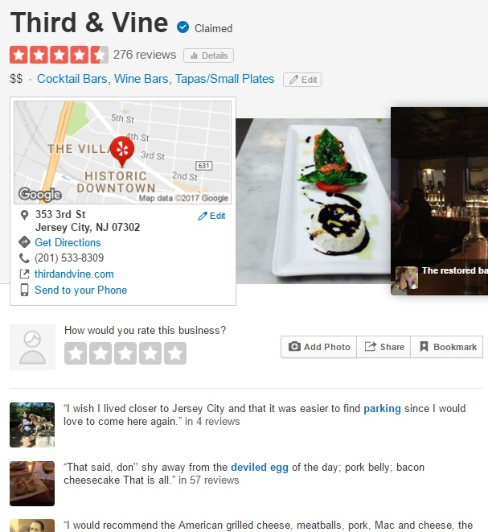
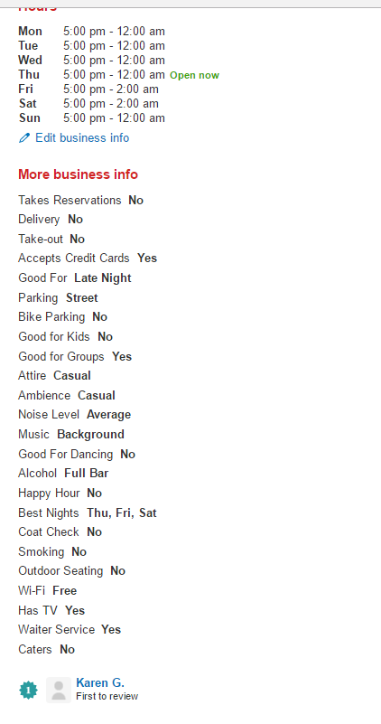
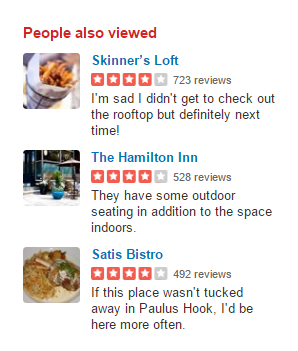

##Website
www.yelp.com

We are considering the recommendations provided after the search and not the main search itself. (The main search recommendation seems to be very comprehensive and is detailed here - https://www.yelp-support.com/article/What-is-Yelp-s-recommendation-software?l=en_US)

## Scenario Analysis
### Who are target users?
The whole general population.

### What are the key goals?
To serve customers with list of businesses by category in the area searched for along with its ratings. Additionally any search should serve up link of other similar businesses of interest to guide navigation till the desired business is found. 

### How can I help to accomplish those goals?
The goals of the business by improving the recommendations to be more aligned with user's habits and history.

##Reverse engineering
### Yelp Restaurant Example

### Yelp Tags

### Yelp Recommendations

The site seems to have taken into consideration 3 factors in recommendation engine - location, rating and cuisine. It served up 3 recommendations - 2 of same price range and 3rd one of a higher price range.

##Recommendations to Improve
1. While the original restaurant was for a place which is classified as a Bar and Tapas place, all the recommendations were only for Bars and none for Tapas. This part of recommendation needs to be improved to atleast serve up 25% of recommendation of the secondary category.
2. The number of recommendations need to be enlarged and also categorized. Right now recommendations don't sit prominently on the page or even the side bar. They should be served up with most popular categories which speak out clearly - "Bar with Outdoor seating", "Tapas place with live music".
3. Seasonal adjustments can be made. e.g. outdoor seating should have more weight in summer months, hot cuisines to have more weight in winter months.
4. Users past ratings and reviews can be considered to build a profile of what businesses he/she likes and factor them into recommendations.
